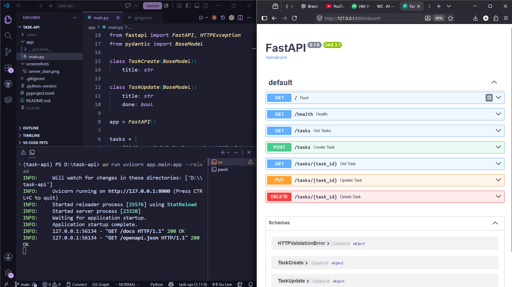

# Task API

A simple CRUD API built with FastAPI for the FlyRank Backend Internship Week 2 Assignment.

## Features

- Create tasks
- Read tasks
- Update tasks
- Delete tasks
- Interactive Swagger documentation

## Requirements

- Python 3.10+
- FastAPI
- Uvicorn

## Installation

```bash
git clone https://github.com/qasimio/task-api.git
cd task-api

uv sync
```

## Run

```bash
uv run uvicorn app.main:app --reload
```

Open

```
http://127.0.0.1:8000/docs
```

## API Endpoints

| Method | Endpoint | Description |
|---------|----------|-------------|
| GET | / | API Info |
| GET | /health | Health Check |
| GET | /tasks | List Tasks |
| GET | /tasks/{task_id} | Get Task |
| POST | /tasks | Create Task |
| PUT | /tasks/{task_id} | Update Task |
| DELETE | /tasks/{task_id} | Delete Task |

## Example curl

```bash
curl http://127.0.0.1:8000/tasks
```

Example response

```json
[
  {
    "id": 1,
    "title": "Learn FastAPI",
    "done": false
  }
]
```

## Swagger UI

